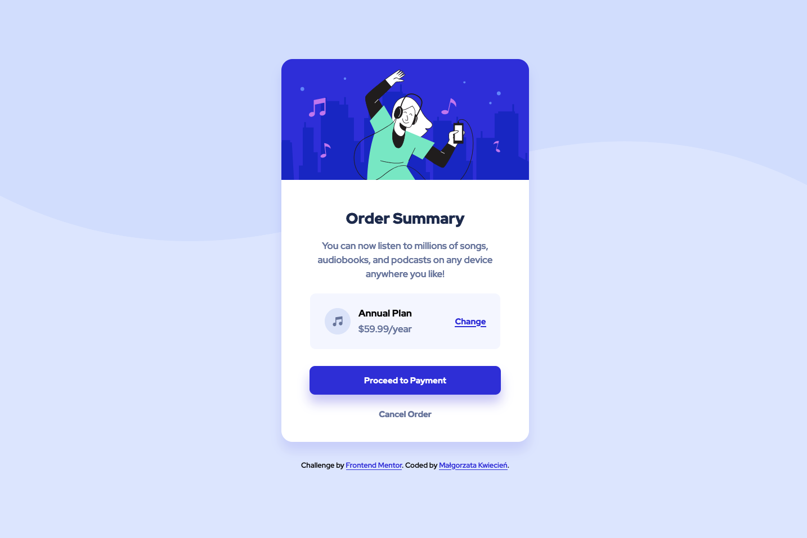

# Frontend Mentor - Order summary card solution

This is a solution to the [Order summary card challenge on Frontend Mentor](https://www.frontendmentor.io/challenges/order-summary-component-QlPmajDUj).

## Table of contents

- [Overview](#overview)
  - [The challenge](#the-challenge)
  - [Screenshot](#screenshot)
  - [Links](#links)
- [My process](#my-process)
  - [Built with](#built-with)
- [Author](#author)

## Overview

### The challenge

Users should be able to:

- See hover states for interactive elements

### Screenshot

### Links

- Solution URL: [GitHub](https://github.com/mkwiecien00/order-summary-component)
- Live Site URL: [GitHub Pages](https://mkwiecien00.github.io/order-summary-component/)

## My process

### Built with

- Semantic HTML5 markup
- BEM methodology
- CSS custom properties
- SASS
- Flexbox
- Mobile-first workflow
- Visual Studio Code

## Author

- Linkedin - [@malgorzatakwiecien00](https://www.linkedin.com/in/malgorzatakwiecien00/)
